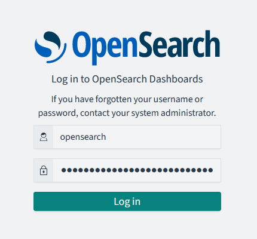
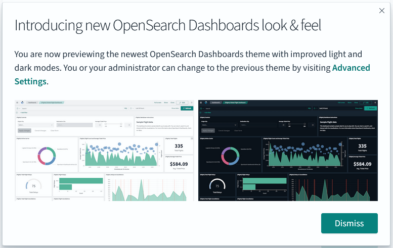
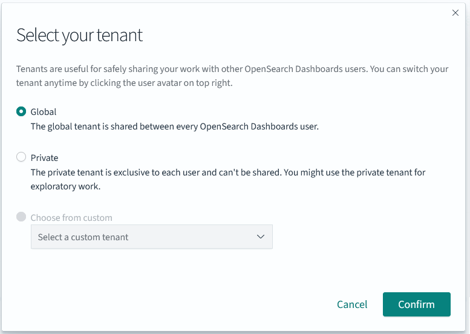
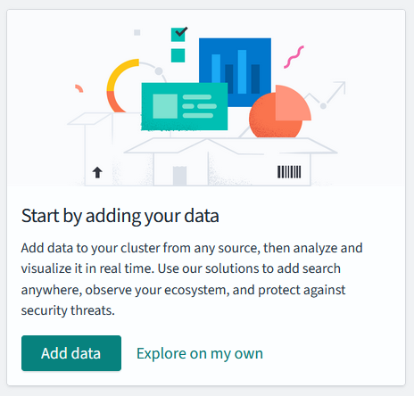
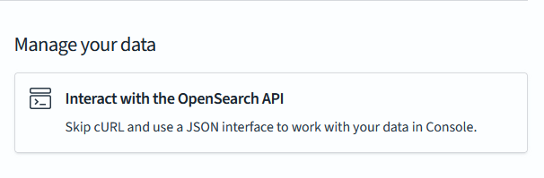
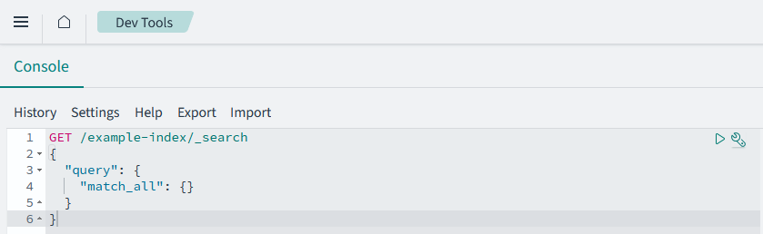
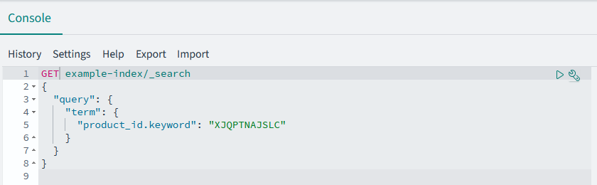
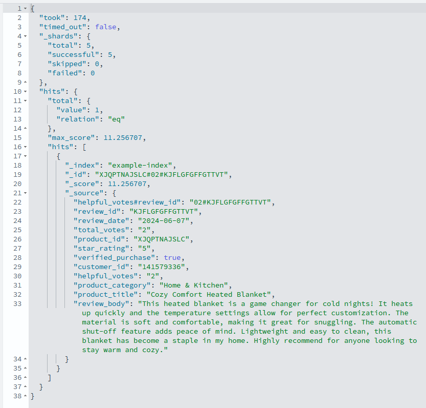

# Guidance for Integrating Amazon DynamoDB and Amazon OpenSearch Service

## Table of Content

### Required

1. [Overview](#overview)
    - [Cost](#cost)
2. [Prerequisites](#prerequisites)
    - [Operating System](#operating-system)
3. [Deployment Steps](#deployment-steps)
4. [Deployment Validation](#deployment-validation)
5. [Running the Guidance](#running-the-guidance)
6. [Next Steps](#next-steps)
7. [Cleanup](#cleanup)
8. [FAQ, known issues, additional considerations, and limitations](#faq-known-issues-additional-considerations-and-limitations-optional)
9. [Notices](#notices-optional)
10. [Authors](#authors-optional)

## Overview

Different databases are designed for different use cases. With these purpose-built databases, developers no longer need to choose a general purpose database that can do many things, but is not perfectly suited to any one particular task. Instead, they can choose a set of databases that are built specifically for the requirements of their application. Integrating those databases together allows developers to keep a consistent set of data that can be queried from the most appropriate database for the access pattern.

Amazon DynamoDB is a serverless, NoSQL, fully managed database with single-digit millisecond performance at any scale. It is ideally suited to support online transaction processing (OLTP) workloads where access patterns are known. These fixed access patterns often make up the bulk of an applications database requests, but other access patterns such as search require more flexibility and can tolerate higher latency.

To support these use cases, DynamoDB is often paired with Amazon OpenSearch Service. OpenSearch Service makes it easy for you to perform interactive log analytics, real-time application monitoring, website search, and more. OpenSearch is an open source, distributed search and analytics suite derived from Elasticsearch.

Most customers interested in integrating DynamoDB and OpenSearch Service should use the managed feature [DynamoDB zero-ETL integration with Amazon OpenSearch Service](https://docs.aws.amazon.com/amazondynamodb/latest/developerguide/OpenSearchIngestionForDynamoDB.html). Amazon DynamoDB offers a zero-ETL integration with Amazon OpenSearch Service through the DynamoDB plugin for OpenSearch Ingestion. Amazon OpenSearch Ingestion offers a fully managed, no-code experience for ingesting data into Amazon OpenSearch Service.

In some specific cases, though, customers may need additional flexibility in their integration. Examples of those cases include:

* Needing to reduce the number of DynamoDB Streams consumers

DynamoDB Streams supports up to two simultaneous consumers per shard. For DynamoDB global tables, simultaneous readers is limited to one. DynamoDB zero-ETL integration with Amazon OpenSearch Service is an additional shard reader. Choosing to use both results in no additional shard capacity to support other event driven business processes. Instead, a service like Amazon SNS or Amazon EventBridge can be used fan out to multiple consuming applications including a self managed DynamoDB to OpenSearch Service integration.

* Certain DynamoDB Single Table designs

While Amazon OpenSearch Ingestion supports processors that can different DynamoDB items to different OpenSearch indexes based on key prefix, it cannot combine multiple DynamoDB items into a single OpenSearch document. This requirement may come up if your DynamoDB design uses multiple DynamoDB items to represent the contents of a list or array, such as products in a shopping cart. DynamoDB [overloaded GSI](https://docs.aws.amazon.com/amazondynamodb/latest/developerguide/bp-gsi-overloading.html) designs also use multiple DynamodB items to represent what would be a single OpenSearch document.

* Inability to use DynamoDB Point-in-time Recovery PITR

Enabling DynamoDB PITR is required in order to move existing data from DynamoDB to OpenSearch Service when using zero-ETL integration. While enabling PITR on all production tables is a best practice, if your organization disallows the use of PITR a different method of migrating existing data is required.

This guidance provides an example of a customer-managed integration between DynamoDB and OpenSearch Service. It creates a DynamoDB table with sample data, migrates that existing DynamoDB data to OpenSearch, and subscribes a Lambda function to DynamoDB Streams to replicate new data as it is written.

   

To load the initial set of data from DynamoDB, the following steps are executed.

1. To process existing data, an AWS Lambda function is invoked to describe the Amazon DynamoDB table and split into a number of segments based on the returned item count. The function writes one message to an Amazon Simple Queue Service (SQS) queue for each segment number.

1. SQS acts as an event source for Lambda. Lambda will invoke functions from messages in the queue and process segments of the DynamoDB table in parallel.

1. The Lambda function uses a parallel scan to read the segment of the DynamoDB table listed in the source event from SQS. 

1. The function then writes the data retrieved from DynamoDB in to Amazon OpenSearch Service in batches through the bulk create operation. 

   

   To support the ongoing load of data from DynamoDB as it is written, the following steps are executed.

1. Insert or update items in Amazon DynamoDB to invoke capture by Amazon DynamoDB Streams.

1. DynamoDB Streams sends item-level modifications captured from DynamoDB to the AWS Lambda streaming update function.

1. The Lambda function writes that data in batches to Amazon OpenSearch Service through the bulk index operation. Track ingested documents with the SearchableDocuments metric in Amazon CloudWatch.

### Cost

_You are responsible for the cost of the AWS services used while running this Guidance. As of June 2024, the cost for running this Guidance with the default settings in the US West2 (Oregon) is approximately $<n.nn> per month for processing ( <nnnnn> records )._

_We recommend creating a [Budget](https://docs.aws.amazon.com/cost-management/latest/userguide/budgets-managing-costs.html) through [AWS Cost Explorer](https://aws.amazon.com/aws-cost-management/aws-cost-explorer/) to help manage costs. Prices are subject to change. For full details, refer to the pricing webpage for each AWS service used in this Guidance._

### Sample Cost Table

**Note : Once you have created a sample cost table using AWS Pricing Calculator, copy the cost breakdown to below table and upload a PDF of the cost estimation on BuilderSpace.**

The following table provides a sample cost breakdown for deploying this Guidance with the default parameters in the US East (N. Virginia) Region for one month.

| AWS Service | Dimensions | Cost [USD] | frequency |
| ----------- | ----------- | ---------- | ---------- |
| DynamoDB Data import from S3 | $0.15 per GB | $0.04 | one time |
| DynamoDB Read Request Units (RRU) | $0.25 per million read request units | $0.02 | one time |
| DynamoDB Read Request Units (RRU) | $0.25 per million read request units | $0.25 | monthly |
| DynamoDB Write Request Units (WRU) | $1.25 per million write request units | $1.25 | monthly |
| DynamoDB Standard table class | $0.25 per GB-month | $0.07 | monthly |
| OpenSearch Service On-Demand t3.medium.search | $0.073 per hour | $53.29 | monthly |
| EC2 On-Demand t3.medium | $0.0416 per hour | $30.37 | monthly |
| Secrets Manager | $0.40 per secret per month | $0.40 | monthly |
| VPC Interface Endpoint | $0.01 per AZ hour | $7.30 | monthly |


## Prerequisites

Make sure you have the following tools installed on your environment:

* [AWS Command Line Interface (CLI)](https://aws.amazon.com/cli/)
* [Node.js](https://nodejs.org/en/download/) 14.15.0 or later
* [Python](https://www.python.org/downloads/) 3.7 or later including pip and virtualenv
* [AWS Cloud Development Kit (AWS CDK)](https://docs.aws.amazon.com/cdk/v2/guide/getting_started.html)

### Operating System

These deployment instructions are optimized to best work on Amazon Linux 2023 (ami-0eb9d67c52f5c80e5).  Deployment in another OS may require additional steps.

## Deployment Steps

1. Clone the repo.
   ```bash
   git clone git@github.com:aws-solutions-library-samples/REPO.git
   ```
1. cd to the repo folder.
   ```bash
   cd REPO
   ```
1. Activate the app's virtual environment.
   ```bash
   source .venv/bin/activate
   ```
1. Install packages in requirements.
   ```bash
   pip install -r requirement.txt
   ```
1. Bootstrap the environment, using the account number and region you plan to deploy to.
   ```bash
   cdk bootstrap aws://ACCOUNT-NUMBER-1/REGION-1
   ```
1. Synthesize the stack.
   ```bash
   cdk synth
   ```
1. Deploy the stack.
   ```bash
   cdk deploy
   ```


## Deployment Validation

* Open CloudFormation console and verify the status of the template with the name starting with DynamoDBOpenSearchStack.
* If deployment is successful, you should see an active DynamoDB table and OpenSearch Service cluster with names starting with "DynamoDBOpenSearchStack" in the DynamoDB and OpenSearch consoles.
* If deployment is successful, you should see several outputs from the CDK template in your console window.


## Running the Guidance

1. Wait for the CDK template to finish deploying if it has not already done so.
1. Retrieve the OpenSearch cluster admin password from Secrets Manager. From the CDK and CloudFormation outputs, copy the value for "DynamoDBOpenSearchStack.AdminPasswordSecretArn" and insert it into the following aws cli command as the secret-id. 
   ```bash
   aws secretsmanager get-secret-value --secret-id arn:aws:secretsmanager:us-west-2:111122223333:secret:AdminPasswordSecreta1b2c3d4-EXAMPLE11111-a1b2c3 --query 'SecretString' --output text
   ```
1. Copy the value for the OpenSearch admin password from the cli response, making sure not to include the surrounding quotation marks.
1. In a web browser, navigate to the proxy jumphost for your OpenSearch cluster. This value is provided in the CDK and CloudFormation outputs as "DynamoDBOpenSearchStack.DashboardsURLviaJumphost", and will be in the form of `"https://XXX.XXX.XXX.XXX"`.
1. Enter the username "opensearch" and the password you copied in the previous step, then click "Log in".
   
1. Click "Dismiss".
   
1. Leave "Global" selected as the tenant and click "Confirm".
   
1. Click "Explore on my own"
   
1. Under manage your data, click "Interact w ith the OpenSearch API".
   
1. In the Dev Tools console, enter the following query, then click the play button. You will see results in the right pane. These were copied over from DynamoDB by the initial load Lambda.
   ```
   GET /example-index/_search
   {
      "query:": {
         "match_all": {}
      }
   }
   ```
   
1. Write a new item into DynamoDB to demonstrate ongoing replication. From the CDK and CloudFormation outputs, copy the value for "DynamoDBOpenSearchStack.DynamoDBTableName". Run the following aws cli command, replacing the table-name value with the value you copied from outputs.
   ```bash
   aws dynamodb put-item --table-name DynamoDBOpenSearchStack-DynamoDBTablecdef-EXAMPLE11111 --item '{
     "product_id": {
       "S": "XJQPTNAJSLC"
     },
     "helpful_votes#review_id": {
       "S": "02#KJFLGFGFFGTTVT"
     },
     "customer_id": {
       "N": "141579336"
     },
     "helpful_votes": {
       "N": "2"
     },
     "product_category": {
       "S": "Home & Kitchen"
     },
     "product_title": {
       "S": "Cozy Comfort Heated Blanket"
     },
     "review_body": {
       "S": "This heated blanket is great!"
     },
     "review_date": {
       "S": "2024-06-07"
     },
     "review_id": {
       "S": "KJFLGFGFFGTTVT"
     },
     "star_rating": {
       "N": "5"
     },
     "total_votes": {
       "N": "2"
     },
     "verified_purchase": {
       "BOOL": true
     }
   }'
   ```
1. After writing the item to DynamoDB, return to the OpenSearch Dev Tools console. Enter and run the following query, searching for the specific item you added to DynamoDB.
   ```
   GET /example-index/_search
   {
      "query:": {
         "term": {
            "product_id.keyword": "XJQPTNAJSLC"
         }
      }
   }
   ```
   
1. You will see results in the right pane. These were copied over from DynamoDB by the ongoing replication Lambda which was invoked by DynamoDB Streams.
   


## Next Steps

This guidance provides a basic example of a DynamoDB integration with OpenSearch through DynamoDB Streams and Lambda. In a production environment, a similar solution should take several things into consideration. Here are some additional questions and considerations.

* Add any additional transformations in the replicating Lambda functions. If your application uses a design that requires aggregation or augmentation before documents are written to OpenSearch include that logic in the replication functions.
* Follow [operational best practices for Amazon OpenSearch service](https://docs.aws.amazon.com/opensearch-service/latest/developerguide/bp.html#bp-stability). This guidance provisions a single node to provide a low cost demonstration. A production environment should leverage dedicated master nodes and deploy across multiple availability zones.
* Use a more robust access proxy for OpenSearch. This guidance uses a single nginx proxy to access OpenSearch dashboards. A production environment should deploy a [more scalable solution](https://docs.aws.amazon.com/solutions/latest/centralized-logging-with-opensearch/access-proxy-1.html) with autoscaling proxies and a load balancer.


## Cleanup

To cleanup installed resources, run `cdk destroy`.

## FAQ, known issues, additional considerations, and limitations

**Additional considerations**

- This Guidance created an Amazon OpenSearch Service cluster and Amazon Elastic Compute Cloud (Amazon EC2) instance that are billed per hour irrespective of usage. Clean up resources when you are finished to avoid unexpected costs.

For any feedback, questions, or suggestions, please use the issues tab under this repo.

## Notices

*Customers are responsible for making their own independent assessment of the information in this Guidance. This Guidance: (a) is for informational purposes only, (b) represents AWS current product offerings and practices, which are subject to change without notice, and (c) does not create any commitments or assurances from AWS and its affiliates, suppliers or licensors. AWS products or services are provided “as is” without warranties, representations, or conditions of any kind, whether express or implied. AWS responsibilities and liabilities to its customers are controlled by AWS agreements, and this Guidance is not part of, nor does it modify, any agreement between AWS and its customers.*


## Authors

John Terhune
Jon Handler